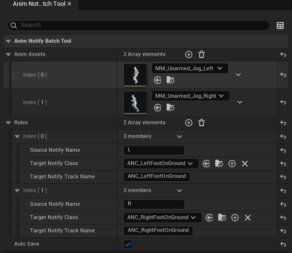
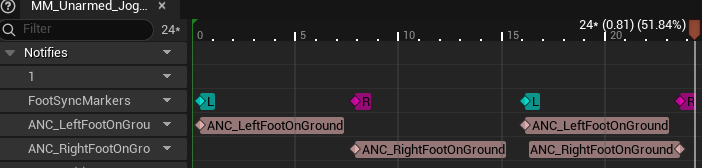

# Anim Notify Batch Tool 使用文档 (UE 5.7)

一个用于批量处理动画资产的编辑器工具。它可以根据动画中已有的 **Anim Notify** （含Sync Marker同步标记）的名字，在同一帧自动添加指定的 **AnimNotify 类**。

## 1. 安装与启动

1.如果你是UE5.7可以直接下载Release打包好的二进制文件，按照正常插件安装流程即可

自己编译可以参照以下流程：

将插件代码放入工程的 `Plugins` 目录

右键 `.uproject` 选择 `Generate Visual Studio project files`

在 VS 中编译 `Development Editor` 配置

2.**启用插件**：在 UE 编辑器菜单 `Edit -> Plugins` 中搜索 `Anim Notify Batch Tool` 并确保勾选 `Enabled`。

3.**打开面板**：点击编辑器顶部菜单栏：`Window -> Anim Notify Batch Tool` 或 `Tools -> Anim Notify Batch Tool` 即可打开操作面板。

## 2. 参数说明

面板分为两个主要配置区域：

### 2.1 全局配置

-**Anim Assets**：待处理的动画资产列表。支持从内容浏览器批量拖入多个 `AnimSequence`。

-**bAutoSave**：处理完成后是否自动保存资产（默认为 `false`，建议手动确认后再保存）。

### 2.2 Rules (处理规则)

点击 `+` 号可以添加多条规则，每条规则包含：

-**Source Notify Name**：源名称。可以是动画中已有的 `AnimNotify` 的名字，也可以是 `Sync Marker`（如 `FootSyncMarkers` 轨上的 `L` 或 `R`）的名字。

-**Target Notify Class**：目标类。直接拖入你想要添加的 `AnimNotify` 蓝图类或原生 C++ 类。

-**Target Notify Track Name**：目标轨道名。

    -**如果不填**：新增的 Notify 会被放在第 1 条轨道（Track 0）。

    -**如果填写名字**：工具会寻找同名轨道；如果找不到，会自动创建一个新轨道并以此命名。

## 3. 使用流程

1. 打开 **Anim Notify Batch Tool** 面板。
2. 在 **Anim Assets** 中批量拖入需要处理的动画。
3. 在 **Rules** 中配置映射关系。例如：

   -`Source Notify Name`: `L`

   -`Target Notify Class`: `BP_ANC_LeftFootOnGround`

   -`Target Notify Track Name`: `FootstepTracks`
4. 点击面板最下方的 **Apply** 按钮。
5. 查看 **Output Log**（输出日志）确认处理结果。工具会自动跳过在同一帧已经存在相同 Notify 的情况，防止重复添加。

